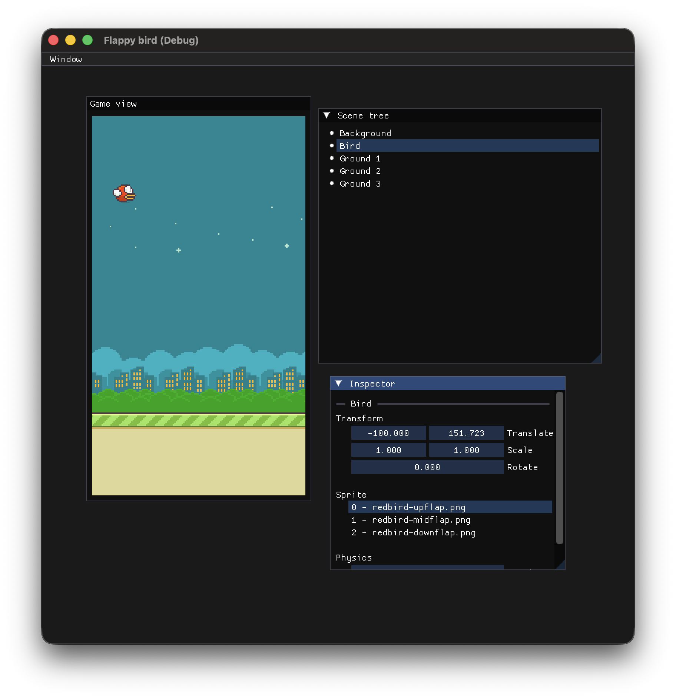

# Flappy bird

A flappy bird game made with the [GEV0 engine](https://github.com/GhoulKingR/game-engine-v0).


## Requirements
This project depends on the following:
* OpenGL
* glm
* SDL3
* CMake
* Make

Platform-wise, this engine is verified to run on macOS and Linux.

## How to run

Download the engine code and assets files using this command:
```
git submodule update --init
```

Create a build directory and enter into it:
```
mkdir build
cd build
```

Build the game:
```
cmake ..
make
```

After this, you can now run the game using by running `./flappybird`.
